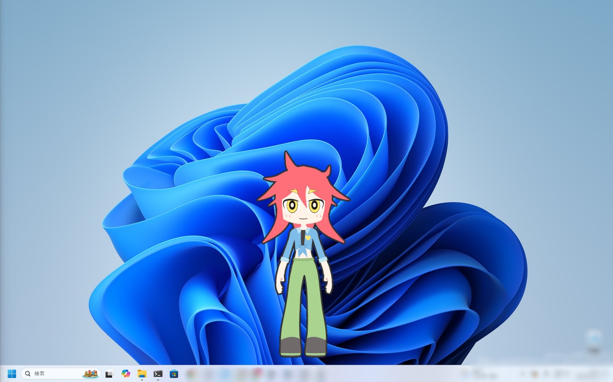
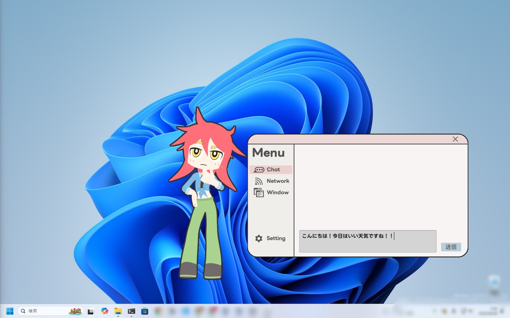
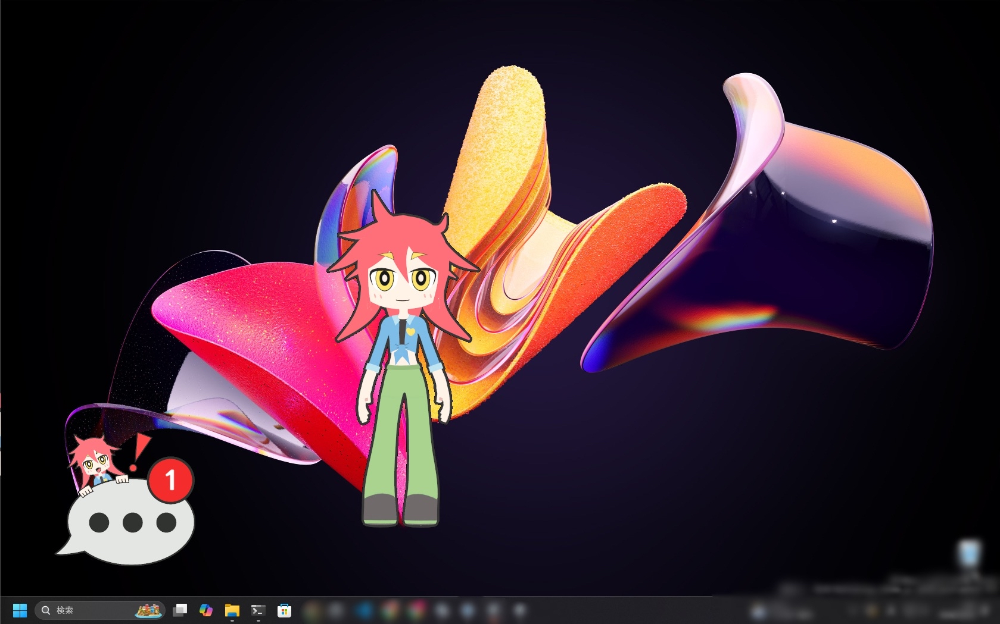
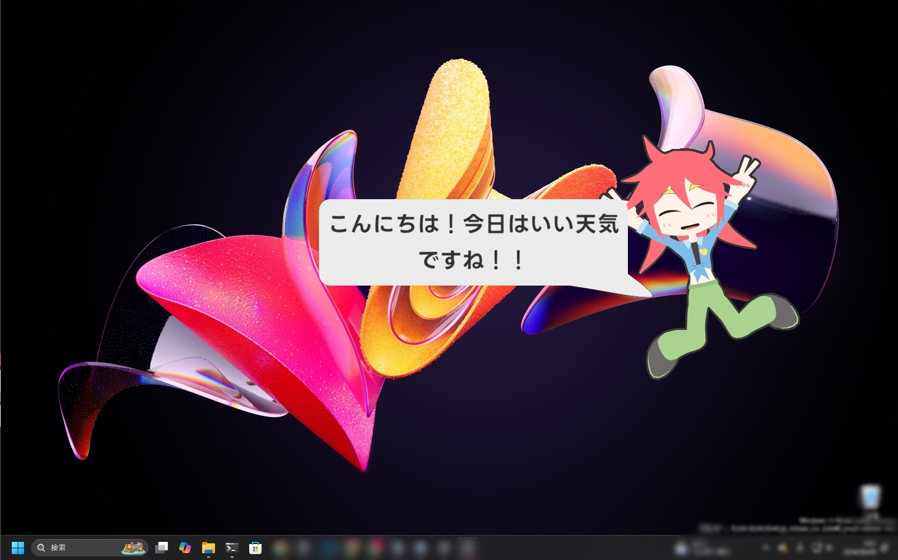
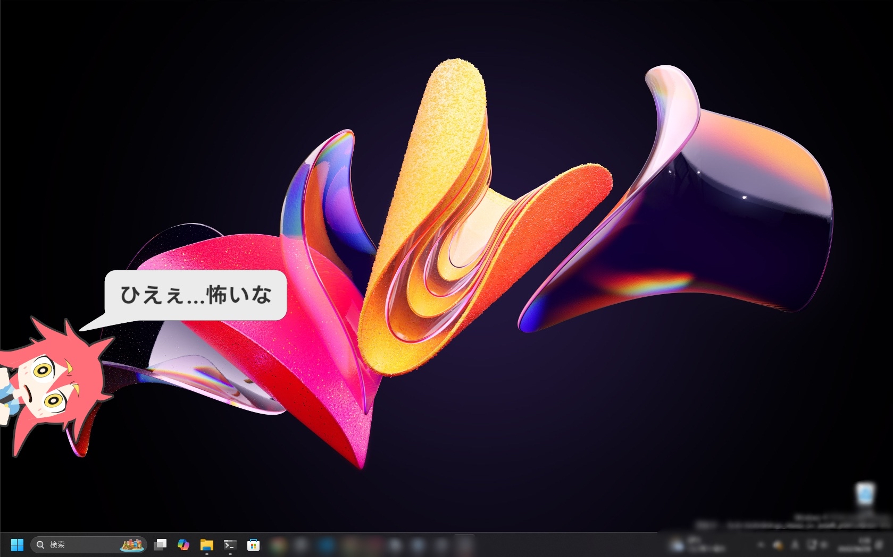

# Desktop Connect

## プロジェクトの概要
本プロジェクトは、デスクトップ画面上に表示される3Dキャラクターを介して表現豊かに交流できる遠隔コミュニケーションツールです。\
※本プロジェクトは、大学での卒業研究で制作したシステムをベースにブラッシュアップを行ったものです。

## スクリーンショット
**待機状態** | **メニュー画面** 
:---:|:---:
 |  | 

| **通知アイコン**
:---:|
 |

**キャラクターの感情表現（喜び）** | **キャラクターの感情表現（恐怖）** 
:---:|:---:
 |  |

## 開発環境とセットアップ
**Unityバージョン**：Unity 6.0(6000.0.58.f2) \
**対象プラットフォーム**：Windows \
### 起動方法
※本プロジェクトは、サーバーとクライアントが同じプロジェクトファイル内に同梱されています。
1. 同梱されている `Builded_Server/DesktopConnect.exe` を実行し、サーバーを起動します。
2. Unityエディタで本プロジェクトを開き、`Assets/Project/Scenes/DC_Client` シーンを開きます。
3. Hierarchy内にある「GPT」オブジェクトを選択し、Inspector内の指定箇所に **OpenAIのAPIキー** を入力してください。
4. Unityエディタの再生ボタンを押してクライアントを起動します。
5. 起動後、キャラクターを**右クリック**してメニューを開き、[Network] から接続先サーバーを指定して接続します。
   - ローカル環境: `ws://localhost:8080/`
   - リモート環境: `ws://[サーバーPCのIPv4アドレス]:8080/`/
- **※同梱されているビルド済みアプリケーションは、送信相手と受信相手が同じ（自分自身）になるよう設定されています。**
### 操作方法
- **左クリック**: キャラクターの移動、メニューの選択
- **右クリック**: メニューの表示
- **ホイールボタン**: 状態のリセット

## 工夫点
### 独自のシェーダーによるキャラクターの表現力の向上
髪の毛で眉が隠れてしまわないように、ステンシルやローカル座標系を用いた描画処理の実装を行っています。
- ***該当するプログラム** `Assets/Project/Shader/Character/000_face.shader`, `Assets/Project/Shader/Character/000_hair.shader`
### 動的に変更可能なアニメーションデータ
「ポーズトゥポーズ」手法とUntiyのHumanoidのmuscle値を用いて、各アニメーションを独自の構造で保存・管理しています。
- ***該当するデータ** `Assets/StreamingAssets/Animation`
### アニメーションの変更と適用
LLMがユーザーのメッセージから「強い感情」か「弱い感情」かを判断し、その解析結果に基づいてキャラクターのパラメータを動的に変化させます。\
`DefaultChange`, `PoseChange`には変更したい要素とパラメータの上限値・下限値があらかじめ定義されており、感情の強さに応じてパラメータの線形補完を行っています。/
- ***該当するプログラム（変更）** `Assets/Project/Scripts/Server/JsonAnimation/AnimationChanger.cs`
- ***該当するプログラム（適用）** `Assets/Project/Scripts/DesktopConnect/View/Character/JsonAnimation.cs`

## リポジトリの作成について
研究での使用、およびブラッシュアップ時に使用していたリポジトリのコミット履歴にOpenAIのAPIキーが含まれていたため、本プロジェクト用に新しくリポジトリを作り直して提出しております。

## 使用している外部ライブラリ・アセット
本プロジェクトでは、以下の外部ライブラリおよびアセットを使用しています。

* **websocket-sharp**
  * 用途: サーバーとのWebSocket通信の実装に使用
  * ライセンス: MIT License
  * URL: https://github.com/sta/websocket-sharp

* **UniRx**
  * 用途: イベント処理やスレッド間受け渡しに使用
  * ライセンス: MIT License
  * URL: https://assetstore.unity.com/packages/tools/integration/unirx-reactive-extensions-for-unity-17276?locale=ja-JP&srsltid=AfmBOoolzU6F4ydg_hmMSZkvAKzMu2CJ3h4dfJKYFHDzRDlsIxfkYS_7

* **UniTask**
  * 用途: Unityにおける非同期処理（async/await）に使用
  * ライセンス: MIT License
  * URL: https://github.com/Cysharp/UniTask

* **LINE Seed JP**
  * 用途: プロジェクト内のUIテキスト用日本語フォントとして使用
  * ライセンス: SIL Open Font License 1.1 (OFL)
  * URL: https://seed.line.me/index_jp.html